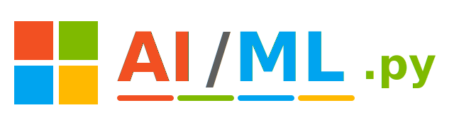

<div align="center">



### *A Journey Through Microsoft's AI/ML Professional Certificate*

**🐍 Written in Python. Powered by Curiosity. 🐍**


</div>

---

## 🧭 The Manifesto

> *"Every notebook run, every model trained, every metric improved — is one step closer to shipping real AI."*

This repository documents my hands-on journey through **Microsoft's AI/ML Professional Certificate on Coursera**. It's not a certificate screenshot — it's the actual code, notebooks, and experiments I've built along the way, module by module, concept by concept.

---

## 📊 Progress Stats

<div align="center">

| ⚡ Metric | 🎯 Value |
|:---:|:---:|
| **Notebooks / Scripts Completed** | `<!--NOTEBOOK_COUNT-->0<!--END_NOTEBOOK_COUNT-->` 🔵 *(auto-updates on every push)* |
| **Language** | `Python` |
| **Platform** | `Microsoft × Coursera` |
| **Track** | `AI/ML Professional Certificate` |
| **Current Focus** | `Model building & evaluation` |
| **End Goal** | `AI/ML Engineer @ Google 🎯` |

</div>

---

## 🗺️ Curriculum Coverage

<div align="center">

| 🐍 Python Foundations | 📊 Data Handling | 🤖 Machine Learning | 🧠 Deep Learning |
|:---:|:---:|:---:|:---:|
| Core syntax, NumPy, Pandas | Cleaning, EDA, Visualization | Regression, Classification, Clustering | Neural Nets, CNNs, RNNs |

| ☁️ Azure AI Services | 📈 Model Evaluation | 🔤 NLP | 👁️ Computer Vision |
|:---:|:---:|:---:|:---:|
| Cognitive Services, Azure ML | Metrics, Cross-validation, Tuning | Text processing, Transformers | Image classification, OpenCV |

</div>

---

## ⚙️ Repo Structure

```
AI-ML-Microsoft-Certificate/
│
├── 01-python-foundations/
│   └── ...
├── 02-data-analysis-pandas-numpy/
│   └── ...
├── 03-machine-learning/
│   └── ...
├── 04-deep-learning/
│   └── ...
├── 05-azure-ai-services/
│   └── ...
├── 06-nlp-and-computer-vision/
│   └── ...
├── projects/
│   └── capstone-project.ipynb
└── README.md   ← you are here
```

**Naming Convention:** `NN-topic-name/notebook-or-script.py(.ipynb)`
Organized by module order — so anyone (including future me) can follow the exact learning path.

---

## 🧠 Why This Repo Exists

```python
while not goal_achieved:
    learn(next_module())
    build(hands_on_project())
    commit("One module closer to AI/ML mastery")
    push()

goal_achieved = "AI/ML Engineer @ Google"
```

I'm currently pursuing a **BS in Data Science & Applications (IIT Madras)** alongside a **BSc in Physical Education & CS (DDU College, Delhi University)**, and working through the **Microsoft AI/ML Professional Certificate** to build practical, portfolio-ready ML skills on top of my DSA foundation.

---

## 🏆 Milestones

- ✅ Python & data-handling fundamentals
- ✅ Core machine learning algorithms implemented from scratch
- ⬜ Deep learning models (CNNs / RNNs)
- ⬜ Azure AI services integration
- ⬜ Capstone project deployment
- ⬜ Certificate completed *(loading...)*

---

## 🤝 Connect & Follow the Journey

<div align="center">

[](https://www.coursera.org/)
[](https://github.com/ManishSharma45512)

</div>

---

<div align="center">

### 💬 "Machine learning is the last invention humanity will ever need to make." — Nick Bostrom

**⭐ Star this repo if you're on a similar AI/ML learning journey ⭐**

```
   >>> if you're reading this, go train one more model <<<
```

</div>
